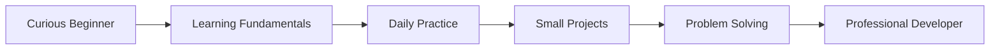

<p align="center">
  
</p>

# 👋 Hey, I'm Vivek Gautam 👨‍💻

<p align="center">
  
</p>

<p align="center">
  
  
</p>

---

## 🧠 About Me (Animated Identity)

<p align="center">
  
</p>

```diff
+ Builder by passion
+ Learner by discipline
+ Developer by consistency
```

I am focused on **progress, not perfection**.
Every day I sharpen my logic, improve my code, and move one step closer to mastery.

---

<p align="center">
  
</p>

## 🛠️ Tech Stack

<p align="center">
  

<p align="center">
  
</p>
</p>

```text
Frontend   : HTML | CSS | JavaScript
Programming: Python | C | C++
Core Skills: Logic Building | DSA Basics | Problem Solving
Tools      : Git | GitHub | VS Code
```

---

## ⚡ Live GitHub Activity (Motion Mode)

<p align="center">
  
</p>

<p align="center">
  
</p>

<p align="center">
  
  
</p>

<p align="center">
  
</p>

---

## 🚀 Learning Journey: Beginner ➜ Professional



* 🔰 Started with **programming fundamentals**
* 📚 Learning by **building & breaking code**
* 🧩 Practicing problems on **HackerRank**
* 🛠️ Creating small but meaningful projects
* 🎯 Long-term goal: **Full-Stack + AI Developer**

---

## ⚡ Live Developer Loop (Animated)

<p align="center">
  
</p>

```text
Observe → Think → Code → Debug → Improve → Repeat
```

```text
Code → Think → Debug → Improve → Repeat
```

* 👨‍💻 Write clean, readable code
* 🧠 Strengthen problem-solving skills
* 📈 Learn at least one new concept daily
* 🔁 Stay consistent, even on hard days

---

## 🌐 Connect With Me (Animated Badges)

<p align="center">
  <a href="https://www.hackerrank.com/profile/dev_vivekgautam"></a>
  <a href="https://www.linkedin.com/in/vivek-gautam-2737a7367/"></a>
  <a href="https://github.com/devvivekgautam-coder"></a>
  <a href="https://www.instagram.com/mr__india__3207/"></a>
</p>

---

## 🧠 Live Developer Philosophy (System Mode)

<p align="center">
  
</p>

```cpp
while(system.isAlive()) {
  learn();
  build();
  breakThings();
  fixBetter();
}
```

> "Discipline turns potential into skill." ⚙️

---

## 🐍 Contribution Snake (Auto‑Animated)

<p align="center">
  
</p>

---

## 📦 Live Project Zone (Animated Placeholder)

<p align="center">
  
</p>

<p align="center">
  
</p>

---

## 🌌 Vision Ahead

```diff
+ Advanced JavaScript & Frameworks
+ Strong Backend Development
+ Data Structures & Algorithms
+ AI & Machine Learning Foundations
+ Scalable, real-world applications
```

I am building toward a **future-proof skill set** focused on impact, quality, and growth.

---

<p align="center">
  
</p>

⭐ *Follow my journey — one commit, one lesson, one breakthrough at a time.* 🚀

<p align="center">
  
</p>
